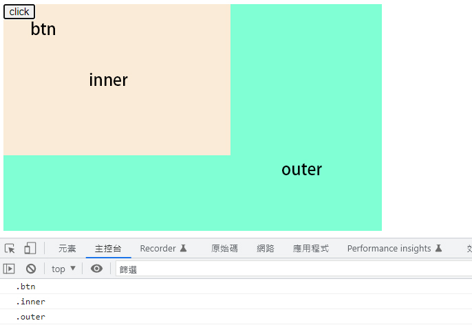
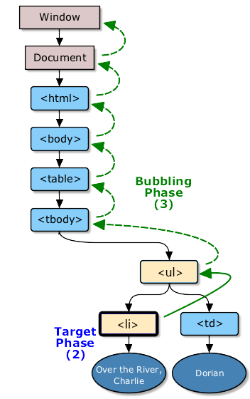

# event delegation 事件代理

先看看以下的例子

我們在 button 外面加上一個 inner 元素和 outer 元素並加上 click 事件，當點擊 button 時，哪個事件會先被觸發呢 ?

```html title="/src/index.html"
<div class="outer">
  <div class="inner">
    <button class="btn">click</button>
  </div>
</div>
```

```js title="/src/index.js"
function addEvent(classname) {
  document.querySelector(classname).addEventListener("click", () => {
    console.log(classname);
  });
}
addEvent(".outer");
addEvent(".inner");
addEvent(".btn");
```



## EventListener 的三個參數

```js
addEventListener(type, listener, useCapture);
```

#### `type` 指定事件名

#### `listener` 指定事件觸發時執行的函數

#### `useCapture` 布林值(預設為 false)，指定事件在捕獲或冒泡階段執行

- true -事件會在捕獲階段執行

- false -事件會在冒泡階段執行

## DOM 的事件冒泡、事件捕獲

> DOM 分別有事件冒泡和事件捕獲兩個概念，而這兩個概念都是為了**解決頁面中事件流（事件發生順序）的問題**。

### 事件冒泡階段

#### **Note: eventlistener 預設為冒泡**

> 微軟提出了事件冒泡(event bubbling)的事件流。事件冒泡可以比喻為泡泡從水底冒出水面的過程。也就是說，事件會從最內層的元素開始發生，一直向上傳播，直到 document。

- 因此上面的例子在事件冒泡的概念下發生 click 事件的順序應該是

```
div btn -> div inner -> div outer -> body -> html -> document
```

### 事件捕獲階段

> 網景提出另一種事件流名為事件捕獲(event capturing)。與事件冒泡相反，事件會從最外層開始發生，直到目標元素。

- 因此上面的例子在事件捕獲的概念下發生 click 事件的順序應該是

```
document -> html -> body -> div outer -> div inner -> div btn
```

### 目標階段

> **“ target 就是你所點擊的那個目標 ”**，這時候在`target`身上所加的`eventListenr`會是`AT_TARGET`這一個 Phase。

- 目標階段沒有分捕獲或冒泡，如果同時有冒泡和捕獲的 `eventListener` 在上面，執行順序實際會依瀏覽器有所不同，Chrome 不論事件添加的先後順序，都是先捕獲後冒泡


## 事件代理的實際應用

底下的例子有一個 ul，底下有很多個 li，如果每一個 li 都加上一個 eventListener，有 1000 個，程式就需要多加 1000 個 eventListener

```html title="/src/index.html"
<html>
  <body>
    <ul id="list">
      <li data-index="1">1</li>
      <li data-index="2">2</li>
      <li data-index="3">3</li>
      <!-- 很多 li 元素 -->
      <li data-index="1000">1000</li>
    </ul>
  </body>
</html>
```

```js title="/src/index.js"
document.getElementById("list").addEventListener("click", (e) => {
  console.log(e.target.getAttribute("data-index"));
});
```

- 我們剛剛已經知道 **(eventLisener 預設為冒泡)**，**任何點擊 li (子元件) 的事件其實都會傳到 ul (外層元件) 身上**



由於事件冒泡，點擊 `li` 時，事件透過 `bubbling phase` 傳遞到 `ul` ，此時就會觸發綁定在 `ul` 上的 click 事件，再透過 `target` 找到事件實際發生的元素，因此我們在 `ul` 身上掛一個 listener，就可以達到預期的效果。
